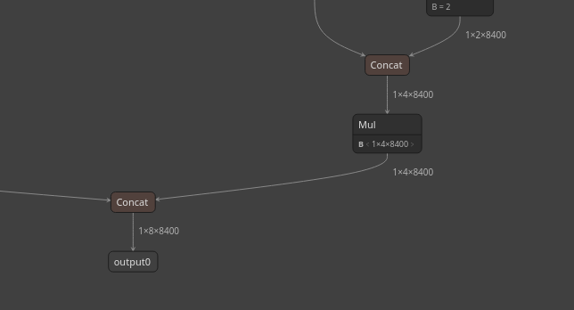

# PT -> ONNX Conversion

## Model conversion

To export a `.pt` model to `.onnx`, use:

`src/kalman_robot/kalman_yolo/scripts/export_onnx.py`

The model path is currently hardcoded in that script.

## OpenCV 4.5.4 issue on Ubuntu 22.04

On Ubuntu 22.04 (as of 2026-02-24), OpenCV 4.5.4 may fail on this model due to a broadcasting issue during concatenation.

As a workaround, you can edit the ONNX graph manually so the concatenated tensors have matching shapes.

1. Open the ONNX model in [Netron](https://netron.app/).
2. Near the end of the model, find the concatenation part (similar to the image below):
	
3. If tensor shapes do not match, duplicate/copy the required tensor slice to match the expected dimensions. (It could be done by [onnx-modifier](https://github.com/ZhangGe6/onnx-modifier?tab=readme-ov-file))
4. Save the updated ONNX model.